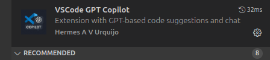

# 🧠 GPT Copilot for VS Code

## 🔗 Relevant links

[](https://marketplace.visualstudio.com/items?itemName=hvurquijo.vscode-gpt-copilot&ssr=false#overview)
[](https://github.com/havurquijo/gpt_copilot)
[](https://www.linkedin.com/in/hvurquijo)


## 👋 Hey, you there!


Already exploring the GPT APIs and don't want to pay for GitHub Copilot?
But still want **all those awesome features right in VS Code**?

Then this project is for you! 🎯

With this extension, you use **your own OpenAI key** to have an intelligent assistant inside your VS Code – with inline suggestions, code corrections, and even a friendly chat panel. All without relying on additional paid services!

## Description

Extension for Visual Studio Code that integrates the OpenAI API to provide intelligent suggestions, code corrections, and an interactive chat panel — all directly in your favorite editor.

## Cost

Using an OpenAI API key with the `gpt-3.5-turbo` model, the estimated monthly cost is approximately **US$ 3 to US$ 4**, depending on usage volume.
You can check updated prices directly on the [official OpenAI pricing page](https://openai.com/pricing).

## ✨ Features

- 💬 **Chat Panel** with interface integrated into VS Code
- 🤖 **Real-time suggestions** in the editor (smart autocomplete)
- 🛠️ **Correction of selected code snippets**
- 📂 **File upload** as context for the model
- 🌙 Support for the current VS Code theme (light/dark)
- 🔐 OpenAI API key management
- 💡 Support for multiple programming languages

## 🧪 Supported Languages

- JavaScript
- TypeScript
- Python
- Java
- C, C++, C#
- PHP
- Go
- Ruby
- Rust
- HTML, CSS
- JSON, Markdown
- Shell Script
- _(and others via optional global support)_

## 🚀 Extension Installation

1. Open Visual Studio Code.
2. Go to the extensions tab (Ctrl + Shift + X).
3. Search for "VSCode GPT Copilot".
4. Click "Install" on the extension by author "Hermes A V Urquijo".


## 🚀 Project Installation

1. Clone the repository:
```bash
git clone https://github.com/havurquijo/gpt_copilot.git
```

2. Open in VS Code:

```bash
code gpt_copilot
```

3. Compile and start the extension (F5 to open a test window)

## 🔐 API Key Configuration

Run the command:

```bash
> GPT Copilot: Set API key
```

Paste your OpenAI key. The key will be stored securely.

## 📦 Available Commands

| Command                                              | Description                             |
| -----------------------------------------------------|------------------------------------------|
| `>Set API Key`                                      | Saves your API key                       |
| `>Delete OpenAI key`                                | Deletes the stored key                   |
| `>Fix selection with VSCode GPT Copilot (OpenAI)`   | Sends the selected snippet for fixing    |
| `>Ask GPT in chat`                                  | Opens the sidebar panel with GPT chat    |


## 🧠 How to Use

### 1. Inline Suggestions

* Start typing code.
* There's a delay of between 5 and 30 seconds for the suggestion to appear.

### 2. Code Correction

* Select one or more lines of code.
* Right-click the selected code and choose `GPT Copilot: Fix selection with VSCode GPT Copilot (OpenAI)`.


### 3. Chat with GPT

* Run: `Ask GPT in chat`
* Use the interface to converse with the model.
* Send messages, attach context files, and receive intelligent responses.


## 🗂 File Upload (in the panel)

* Click **Select File** to upload a file to use as context for the question.
* The file content is read locally and sent along with your question.

## 🧑‍💻 Development

### Main structure:

* `extension.ts` – Main extension code
* `openai.ts` – Communication with OpenAI API
* `utils.ts` – API key handling and helpers

## 🧰 Requirements

* Node.js
* VS Code
* OpenAI account and key

## 📄 License

This project is licensed under the [MIT License](LICENSE).

---

Developed with 💙 by Hermes A V Urquijo.